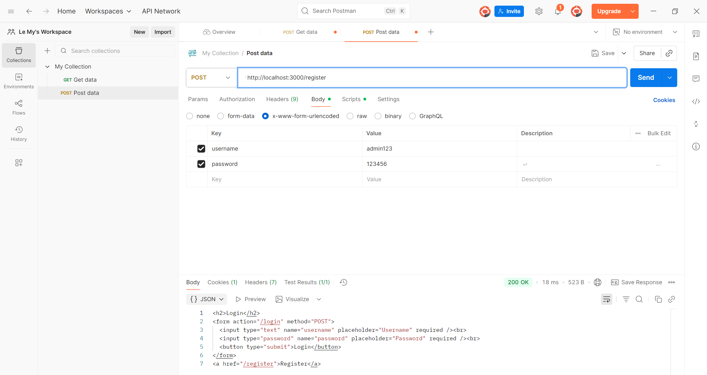
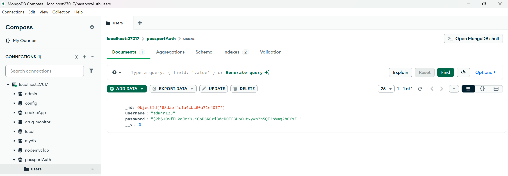
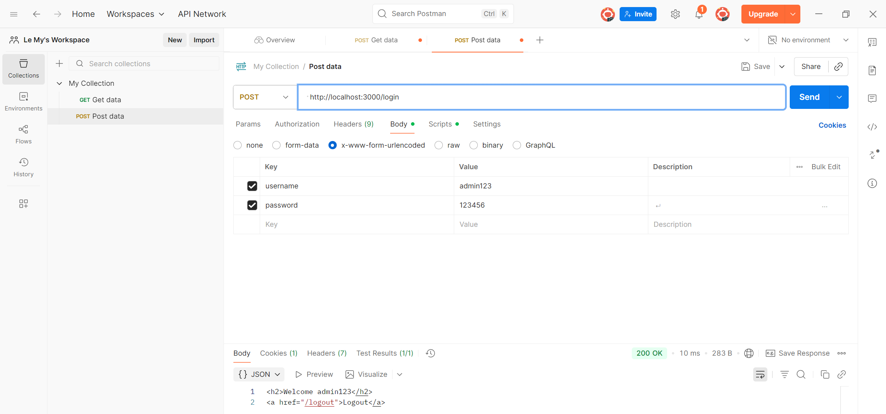
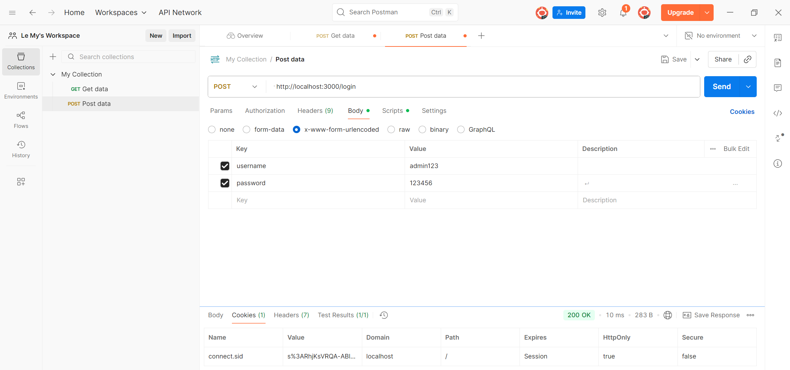
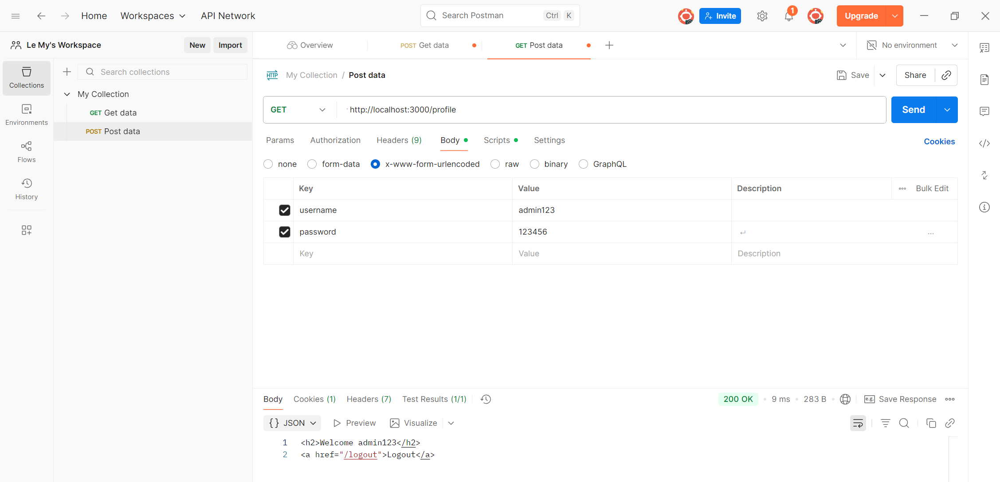

# Local Passport Website
## Giới thiệu

Đây là project thực hành Authentication với Passport.js (LocalStrategy) kết hợp Session + Cookie và MongoDB.

Ứng dụng có các chức năng:

a. Đăng ký (Register)

b. Đăng nhập (Login)

c. Xem profile (Profile)

d. Đăng xuất (Logout)

Session được quản lý bằng express-session, lưu vào MongoDB qua connect-mongo.

Mật khẩu người dùng được hash an toàn bằng bcryptjs.
---
## Cài đặt 
```bash
git clone <https://github.com/LeHoangMy063/local_passport_auth_service>
cd local_passport_auth_service
npm install
```

## Chạy server

node app.js

Server mặc định chạy ở http://localhost:3000
---

## a.Register
1. Tạo một REQUEST mới

2. Ở phần METHOD

- POST: `http://localhost:3000/register` 

Body (x-www-form-urlencoded)
```bash
    "username": "admin123"
    "password": "123456" 
```



Kết quả: { "message": "User registered successfully!" }

3. Check in database

Vào mongodb:

passport_local_Demo -> users



## b. Login

1. Tạo một REQUEST mới

2. Ở phần METHOD

- POST: `http://localhost:3000/auth/login` 


Body (x-www-form-urlencoded)
```bash
    "username": "admin123"
    "password": "123456" 
```





## c. Profile

Yêu cầu: Gửi kèm cookie (được tạo sau khi login).

- GET: `http://localhost:3000/auth/profile`




## d. Logout

- GET: ` http://localhost:3000/auth/logout`


- Session bị xoá, redirect về trang login